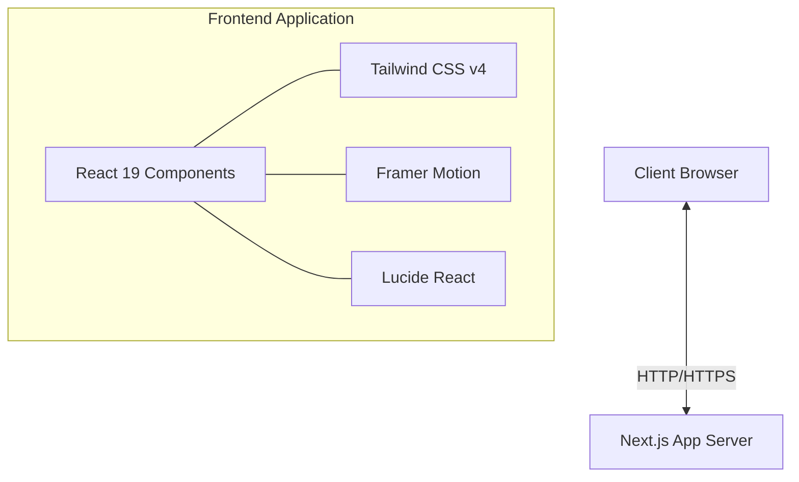
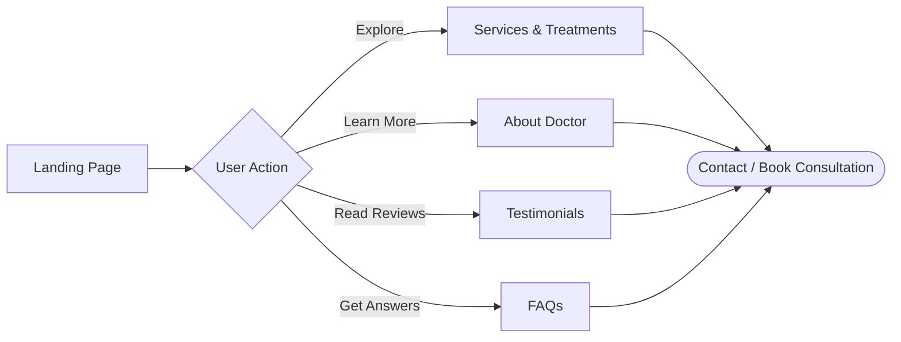
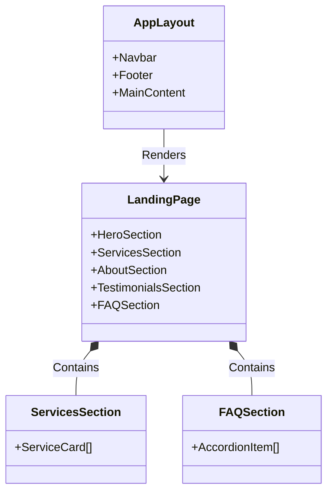

# Lumina Dermatology (Dr. Disha Baxi)

A premium, modern web application for a dermatology clinic and doctor portfolio, built with cutting-edge web technologies.

## Features

- **Elegant Design:** High-contrast aesthetic with soft sage/forest green and luxury gold accents.
- **Responsive Layout:** fully optimized for mobile, tablet, and desktop viewing.
- **Modern Animations:** Smooth, micro-animations using Framer Motion to enhance user engagement.
- **Component-Driven:** Built with reusable, isolated React components.
- **Service & Treatment Showcase:** Clearly presented treatments including Acne, Pigmentation, Anti-Ageing, and more.
- **Dynamic FAQs:** A comprehensive FAQ section for common patient inquiries.
- **Testimonials:** Verified patient reviews showcasing expertise and care quality.

## Tech Stack

This project uses the latest stable tools in the React ecosystem:
- **[Next.js 16](https://nextjs.org/)** - The React Framework for the Web.
- **[React 19](https://react.dev/)** - The library for web and native user interfaces.
- **[Tailwind CSS v4](https://tailwindcss.com/)** - A utility-first CSS framework for rapid UI development.
- **[Framer Motion](https://www.framer.com/motion/)** - A production-ready motion library for React.
- **[Lucide React](https://lucide.dev/)** - Beautiful & consistent icons.
- **[TypeScript](https://www.typescriptlang.org/)** - Strongly typed programming language that builds on JavaScript.

## System Architecture

## User Flow

## Component Structure

